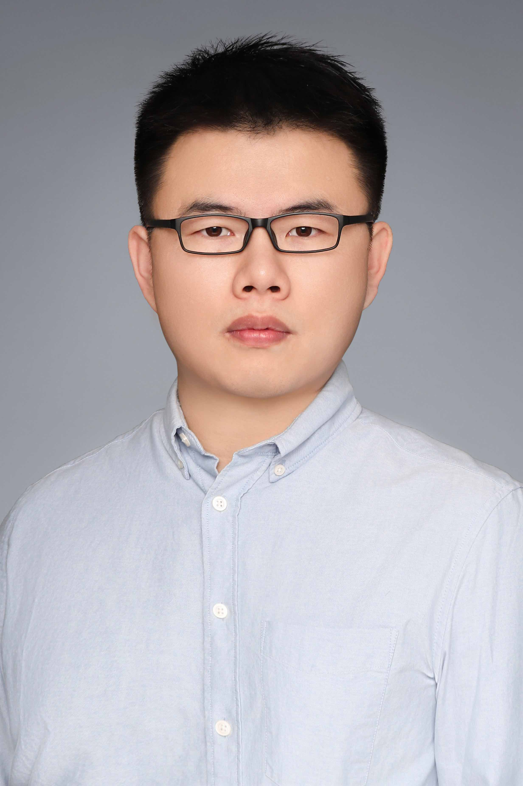
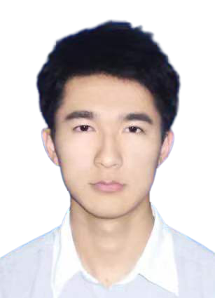
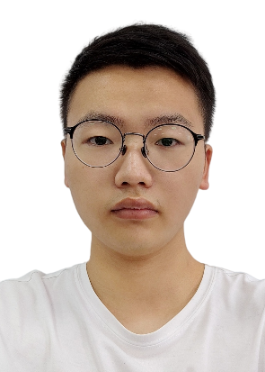
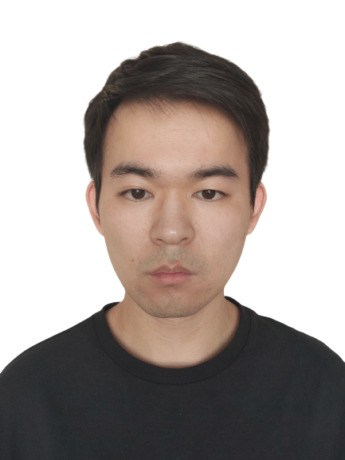
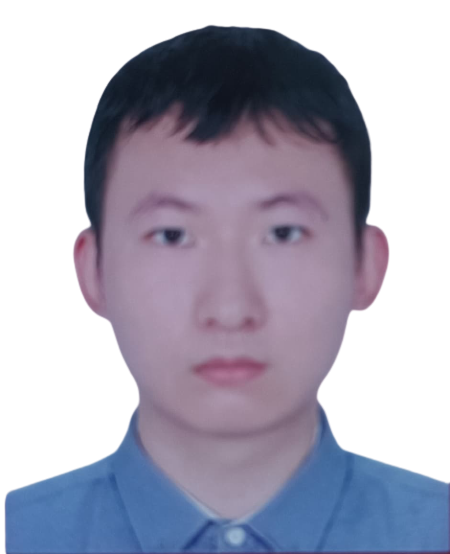

 

 

### 欢迎来到赵义勇的个人主页([Click for English](README.md))  
赵义勇，男，1991年生，教授, 硕士研究生导师，中共党员，2016-2021复旦大学硕博连读, 2020年国家公派至美国宾夕法尼亚州立大学进行联合培养     博士生。2021年7月获复旦大学生物信息学理学博士学位。曾任职于上海药物牧场担任生物信息学&人工智能科学家。2022年入选贵州大学世界双一流学     科高层次人才特聘教授A类(https://www.gzu.edu.cn/2020/0326/c271a132835/pagem.html)，主要从事作物重要农艺性状基因挖掘研究，主     持或参与国家基金、贵州大学高层次人才启动经费项目等，近五年以第一作者或共同第一作者在*Nature*、*Molecular Plant*等顶尖期刊上发表10     余篇SCI论文。所发表的论文入选2021年上海市重大基础研究成果、中国科技期刊卓越⾏动计划重⼤成果，为作物种质资源保护与育种提供了重要基础，     还为基因组学在分子栽培育种上奠定了基础。担任*Molecular Plant*、*Horticulture Research*、*Frontiers Molecular                 Biosciences*、*Molecular Phylogenetics and Evolution*、*Journal of Systematics and Evolution*等期刊审稿人。
    邮箱：fudan@yiyongzhao.com  
    手机/微信：13262259838   
    通讯地址：贵州省贵阳市花溪区贵州大学西校区崇厚楼1035室(550025)  
    人生格言：Head in the Clouds, Feet on the Ground. 

### 研究方向：
1. 农艺性状基因挖掘研究
2. 生物大数据挖掘
3. 多组学数据统计方法和程序开发
 
### 招生意向：
拟招收研究生和科研助理，从事植物生物信息学分析：生信软件开发，多组学整合分析，基因组进化，作物遗传育种分析等。欢迎对科研有兴趣有梦想的     有志青年加入，专业背景不限，欢迎数学，物理，计算机，生物科学，农业相关专业同学的加入！在岗优秀者可留下读硕读博，具体待遇按照研究院统一     标准，长期有效。此外，欢迎本科生来本课题组开展科研任务和本科毕业设计，感兴趣者请邮件联系。

### 科研经历：
2021.03 ~ 现在 :   贵州大学，公共大数据国家重点实验室，特聘教授  
2018.07 ~ 2021.02:  国外博士阶段，Hasselt University，导师：[Luc Claesen](https://www.uhasselt.be/fiche?voornaam=luc&naam=claesen#fiche)  
2019.01 ~ 2019.04:  京东人工智能研究院，导师：[梅涛](http://taomei.me/), [刘武](http://liuwu.weebly.com/)  
2015.09 ~ 2020.12:  国内硕博阶段，广东工业大学
2016 ~ 2021 复旦大学 生物信息学 硕博连读（保送） 理学博士学位
2019 ~ 2020 美国宾夕法尼亚州立大学 生物信息学 国家联合培养博士研究生
2013 ~ 2014 韩国国立江源大学 国家联合培养本科生
2012 ~ 2016 东北林业大学 农学学士学位
### 教育经历
2016 ~ 2021：博士，生物信息学，理学博士学位，复旦大学  
2012 ~ 2016：本科，农学学士学位，东北林业大学
### 论文发表
1.	Zhou, Huizhou, Haoliang Zhao,**Qi Wang***, Liang Lei, Gefei Hao, Yusheng Xu, and Zhen Ye. 2022. EMO-MVS: Error-Aware Multi-Scale Iterative Variable Optimizer for Efficient Multi-View Stereo. Remote Sensing, 2022, 14(23):6085. (通讯作者, IF: 5.349, SCI 2, Top)
2.	**Qi Wang**, Jinxiang Lai, Luc Claesen, Zhengguo Yang, Liang lei, Wenyin Liu. A Novel Feature Representation: Aggregating Convolution Kernels for Image Retrieval. Neural Networks, 2020, 130: 1-10. (IF: 8.05, SCI 1, CCF B, Top)  
3.	**Qi Wang**, Xinchen Liu, Wu Liu, Anan Liu, Wenyin Liu, Tao Mei. MetaSearch: Incremental Product Search via Deep Meta-learning. IEEE Transactions on Image Processing, 2020, 29: 7549-7564. (IF: 10.856, SCI 1, CCF A, Top)   
4.	 **Qi Wang**, Jinxiang Lai, Zhenguo Yang, Xu Kai, Kan Peipei, Liu Wenyin, Lei Liang. Improving Cross-dimensional Weighting Pooling with Multi-scale Feature Fusion for Image Retrieval. Neurocomputing, 2019, 363: 17-26. (IF: 5.719, SCI 2, CCF B, Top) 
5.	  **Qi Wang**, Jingxiang Lai, et al. Beauty Product Image Retrieval Based on Multi-Feature Fusion and Feature Aggregation. In ACMMM, 2018, pp. 2063-2067. (CCF A, Top)
6.	Zhenguo Yang, Qing Li, Haoran Xie, **Qi Wang**, Wenyin Liu. Learning Representation from Multiple Media Domains for Enhanced Event Discovery. Pattern Recognition, 2021, 110:107640. (IF: 7.74, SCI 1, Top)
7.	**Qi Wang**, Liang Lei, Jingxing Lai, et al. Theory Research of Glare Reduction Based on the Fresnel Principle. Optik, 2017, 145: 106-112. (IF: 2.4, SCI 3)
8.	Kai Xu, **Qi Wang**, et al. Biomedical Named Entity Recognition Based on Dictionary Attention GRU network. Computer Applications and Software, 2020, 37(5). (EI)
9.	K. Xu, Z. Yang, P. Kang, **Q. Wang**, and W. Liu. Document-Level Attention-Based BiLSTM-CRF Incorporating Disease Dictionary for Disease Named Entity Recognition. Computers in Biology and Medicine, vol. 108, pp. 122–132, 2019. (SCI 3)  

### 主持或参与的国家级及省级课题项目
1.	**王崎**，贵州省科技厅自然科学基金，2022.04-2025.04，基于茶树树叶图像病害的细粒度识别研究（10万），黔科合基础-ZK[2022]一般108，主持，在研  
2.	**王崎**，国家自然科学基金，2022.01-2025.12，图像大数据的离散化表征理论和研究(36万)，No. 62162008, 主持，在研  
3.	**王崎**，贵州大学培育类项目，2021.09-2024.9，基于植物病害图像的大数据理论研究（5.5万），No.20210042，主持，在研  
4.	**王崎**，贵州大学特岗项目，2021.06-2024.05，少样本细粒度商品识别研究(40万), No. X2021227，主持，在研
5.	**Qi Wang**,  Belgium International Bilateral Scientific Cooperation Project-BOF 2020, 2020.01.01-2020.12.30, Deep Learning Content-Based Few-Shot Product Image Retrieval Algorithms and Architectures (15,900€), No. BOF20BL01, 主持并完成.
6.	孔祥飞，国家自然科学基金，2020.01-2022.12，基于改进的慢特征分析模型的目标变化监测方法研究(27万)，No. 6190070082，参与
7.	刘文印，国家自然科学基金，2018.01-2021.12，共融机器人视觉编程及在线人机协作机制研究(63万)，No. 91748107，参与
8.	刘文印，广东省引进创新团队计划，2016.02-2021.01，城市轨道交通网络控制芯片与系统创新团队– 列车健康诊断与运维服务系统研发及产业化(10,000万)，No. 2014ZT05G157，参与
9.	雷亮，国家自然科学基金，2017.01-2020.12，紫外飞秒脉冲光刻开关光纤光栅的实验研究(60万)，No. 61675050，参与  

### 发明专利
1.	一种基于加权深度特征的图像特征提取方法；刘文印，**王崎**，康培培，徐凯，杨振国，谈季；2019.01.27，CN201910045648.3.  
2.	透视投影式机器学习图像数据标注系统及方法；赖锦祥，雷亮，邓凯元，**王崎**，徐初东，周金运；2018.07.26，CN201810836149. 
3.	一种视频关键帧提取方法、系统及设备和存储介质；刘文印，**王崎**，徐凯，杨振国，雷亮；2018.05.28, CN201810523467.  
4.	一种目标监测方法、系统及设备和存储介质; 刘文印，**王崎**，徐凯，杨振国，雷亮；2018.05.28, CN201810522083.  
5.	一种在线视觉引导对位的激光打标系统和激光打标方法；颜润明，**王崎**，阮杨，邓凯元，雷亮，刘树成，周金云；2018.04.13；ZL201721066651.6.(授权)  
6.	种基于通用振镜与视觉测速的飞行打标系统和控制方法；**王崎**，颜润明，邓凯元，祝大植，刘树成，雷亮，周金云；2018.04.13；ZL201721067205.7.(授权) 
7.	基于特征点匹配的自动测量系统及测量方法；赖锦祥，钟嘉华，**王崎**，叶浩荣，颜润明，雷亮；2019.03.05，ZL201610407110.9.(授权)   
8.	多尺度双轴旋转激光影像三维重构系统及其方法；颜润明，雷亮，**王崎**，刘子强，钟嘉华，赖锦祥，周金运；2018.09.25，ZL201510980774.X.(授权)  

### 在读研究生

苗言铭(博士研究生, 研究方向:时空预测、图卷积)

  

董新宇(硕士研究生, 研究方向:图像文本分析、图像表征)

王建军(硕士研究生, 研究方向:计算机视觉、图像细粒度分析)

邓宏宇(硕士研究生, 研究方向:计算机视觉、图像文本分析)

 
