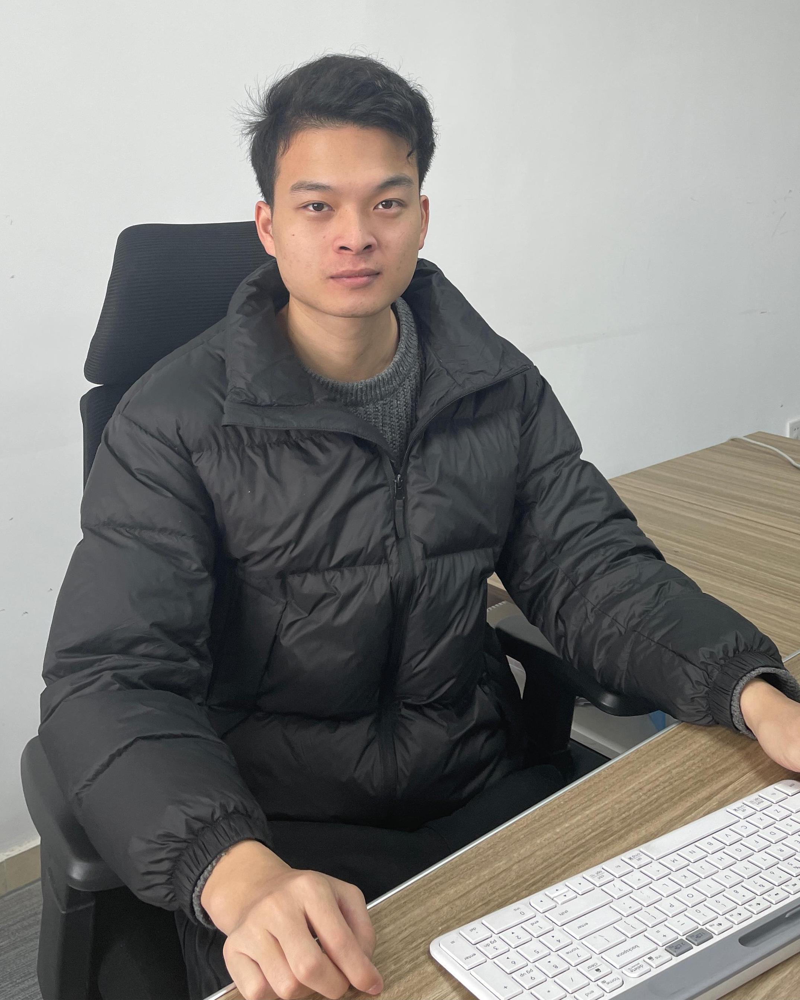
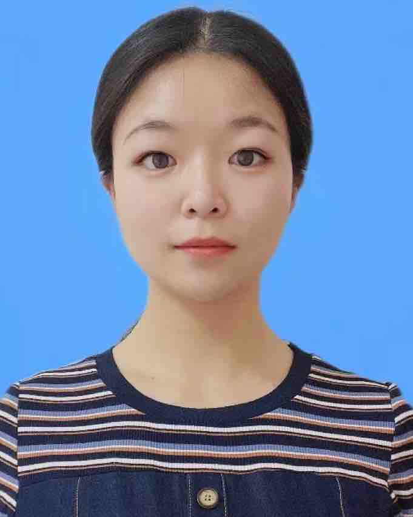

 

 
### 个人简历 ([Click for English](./README.md)) 

赵义勇，男，1991年生，2021年获复旦大学生物信息学理学博士学位，2020年国家公派至美国宾夕法尼亚州立大学进行博士生联合培养，2021年任职于上海药物牧场(创新药研发公司Drug Farm)担任生物信息学&人工智能科学家。2022-2023年 任贵州大学作物遗传育种学科教授,硕士研究生导师，曾入选贵州大学世界双一流学科高层次人才[特聘教授A类](htmls/GZU_Recruitment.html)。目前在哈佛大学进行博士后研究，联合多组学开发和整合新算法来研究基因调控机制和功能。

    邮箱：yiyongzhao16@163.com; yzhao@bwh.harvard.edu
    手机：+18573815442 (USA)  
    微信：zhaorambo

### 教育经历

2016 ~ 2021 复旦大学 硕博连读（保送） 获生物信息学理学博士学位

2019 ~ 2020 美国宾夕法尼亚州立大学 生物信息学 国家联合培养博士研究生

2013 ~ 2014 韩国国立江源大学 国家联合培养本科生

2012 ~ 2016 东北林业大学 获农学学士学位

### 工作经历
2023.05 ~ 至今：美国哈佛大学，博士后

2022.10 ~ 2023.04：贵州大学农学院，特聘教授

2021.06 ~ 2022.06：上海[药物牧场](https://drug-farm.com)，生物信息学&人工智能科学家

### 研究方向
1. 生物大数据挖掘
2. 多组学数据统计方法和程序开发
3. 分子进化和比较基因组学

主要成果
从事生物信息学和计算生物学相关研究，已在Nature、Molecular Plant等顶尖期刊上发表10余篇SCI论文，同行引用超430次。所发表的论文入选2021年上海市重大基础研究成果、中国科技期刊卓越⾏动计划重⼤成果，为作物种质资源保护与育种提供了重要基础，还为基因组学在分子栽培育种上奠定了基础。曾主持或参与国家基金、贵州大学高层次人才启动经费项目等。2022年-至今任Tropical Plants (ISSN 2833-9851)杂志编委,Innovation (ISSN 2959-5150)和Frontiers in Ecology and Evolution, Frontiers in Plant Science等杂志审稿编辑; 担任Molecular Plant、Horticulture Research、Frontiers in Plant Science, Frontiers in Molecular Biosciences、Molecular Phylogenetics and Evolution、Journal of Systematics and Evolution等期刊杂志审稿人。

### 论文发表 (_#_: Co-first author, _*_: Corresponding author, H-index=8, Citations=540)

1. __ZHAO Y__, ZHANG R, JIANG K, QI J, HU Y, GUO J, ZHU R, ZHANG T, EGANA N, YI T-S, HUANG C-H, MA H 2021. Nuclear phylotranscriptomics/phylogenomics support numerous polyploidization events and hypotheses for the evolution of rhizobial nitrogen-fixing symbiosis in Fabaceae. **Molecular Plant** [J]. 2021, 14(5): 748-773 (First author, **IF= 21.949**, Cover story & Featured article, the study reported in dozens of domestic and international mainstream media such as Guangming Daily, People's Daily, China News, Science Daily, Phy.org, etc., Contribution: for the cover article, based on the transcriptome and genome, we constructed the largest phylogenetic relationship of Leguminosae to date. Phylogenetic relationships were resolved for five subfamilies, about 30 genome-wide replication events were identified, the evolutionary history of the nitrogen-fixing gene family was explored, and the important role of a new gene in nitrogen fixation was proposed, providing an important basis for germplasm conservation and breeding in the legume family.)

2. ZHANG L#\*, CHEN F#, ZHANG X#, LI Z#, **ZHAO Y#**, LOHAUS R#, CHANG X#, DONG W, HO S Y W, LIU X, SONG A, CHEN J, GUO W, WANG Z, ZHUANG Y, WANG H, CHEN X, HU J, LIU Y, QIN Y, WANG K, DONG S, LIU Y, ZHANG S, YU X, WU Q, WANG L, YAN X, JIAO Y, KONG H, ZHOU X, YU C, CHEN Y, LI F, WANG J, CHEN W, CHEN X, JIA Q, ZHANG C, JIANG Y, ZHANG W, LIU G, FU J, CHEN F, MA H, VAN DE PEER Y, TANG H 2020. The water lily genome and the early evolution of flowering plants. **Nature** [J], 577: 79-84. (Co-first author, **IF= 49.962**, ESI highly cited paper, Contribution: Involved in the assembly, annotation and correction of transcriptome data of the first aquatic early angiosperm genome. Based on 115 transcriptome and genome-wide data, a highly supported phylogenetic tree of flowering plants was constructed, and molecular clock analysis revealed that early angiosperms originated in the early Cretaceous, while highly supporting the phylogenetic relationships within the Water Lily family. Low-copy nuclear genes from the whole genome confirmed that saprophytic camphor was the earliest differentiated angiosperm. Meanwhile, using a comparative genomics approach, the Blue Star water lily was identified as a potential hybrid parent of two cultivars, laying the foundation for genomics in molecular cultivation breeding.)

3. Lin Cheng#, Mengge Li#, Yachao Wang#, Qunwei Han , Yanlin Hao, Zhen Qiao, Wei Zhang, Lin Qiu, Andong Gong, Zhihan Zhang, Tao Li, Shanshan Luo, Linshuang Tang, Daliang Liu, Hao Yin, Song Lu, Tiago S.Balbuena and __Yiyong Zhao\*__. Transcriptome-based Variations Effectively Untangling the Intraspecific Relationships and Selection Signals in Xinyang Maojian Tea Population. 2023 Volume 14 doi: 10.3389/fpls.2023.1114284. **Frontiers in Plant Science in Plant Bioinformatics**. (**IF=6.627**)

4. CHENG L, CHEN F, HAN Q, LI M, Tiago Santana Balbuena, __ZHAO Y\*__. Phylogenomics as an effective approach to untangle cross-species hybridization event: a case study in the family Nymphaeaceae. 2022. 13. **Frontiers in Genetics-section in computational genomics**. (**IF=4.772**)

5. CHENG L#, LI M#, HAN Q, QIAO Z, HAO Y, Tiago Santana Balbuena, __ZHAO Y\*__. Phylogenomics Resolves the Phylogeny of Theaceae by Using Low-Copy and Multi-Copy Nuclear Gene Makers and Uncovers a Fast Radiation Event Contributing to Tea Plants Diversity.2022. 11(7): 1007. **Biology** (**IF=5.168**)

6. ZHANG L, ZHU X, **ZHAO Y**, Guo J, ZHANG T, HUANG W, HUANG J, HU Y, HUANG C*, MA H 2022. Phylotranscriptomics Resolves the Phylogeny of Pooideae and Uncovers Factors for Their Adaptive Evolution. **Molecular Biology Evolution** [J], 39(2): msac026. (**IF= 16.24**)

7. GUO J, XU W, HU Y, HUANG J, **ZHAO Y**, ZHANG L, HUANG C-H, MA H 2020. Phylotranscriptomics in Cucurbitaceae reveal multiple whole genome duplications and key morphological and molecular innovations. **Molecular Plant** [J], 13: 1-17. (**IF=13.164**)

8. HE C, CHEN Z, **ZHAO Y**, YU Y, WANG H, WANG C, QI J, WANG Y 2022 Histone demethylase IBM1-mediated meiocyte gene expression ensures meiotic chromosome synapsis and recombination.2022. **Plos Genetics** [J], 18(2): e1010041.(**IF= 5.917**)

9. LIANG Y, WANG S, ZHAO C, MA X, **ZHAO Y**, SHAO J, LI Y, LI H, SONG H, MA H, LI H, ZHANG B, ZHANG L 2020. Transcriptional regulation of bark freezing tolerance in apple (*Malus domestica* Borkh.). **Horticulture Research** [J], 7: 205. (**IF= 6.072**)

10. MENG Z, HAN J, LIN Y, **ZHAO Y**, LIN Q, MA X, WANG J, ZHANG M, ZHANG L, YANG Q, WANG K 2020. Characterization of a *Saccharum spontaneum* with a basic chromosome number of x = 10 provides new insights on genome evolution in genus *Saccharum*. **Theoretical and Applied Genetics** [J], 133: 187-199. (**IF= 5.699**)

11. HUANG W, ZHANG L, COLUMBUS J T, HU Y, **ZHAO Y**, TANG L, GUO Z, CHEN W, MCKAIN M, BARTLETT M, HUANG C-H, LI D-Z, GE S, KELLOGG E A, HONG M 2021. A Well-supported nuclear phylogeny of Poaceae and implications for the evolution of C4 photosynthesis. **Molecular Plant**[J], 15(4): 755-777. (**IF=13.164**)

12. MENG F, LIU L, PENG M, WANG Z, WANG C, **ZHAO Y** 2015. Genetic diversity and population structure analysis in wild strawberry (*Fragaria nubicola* L.) from Motuo in Tibet Plateau based on simple sequence repeats (SSRs). **Biochemical Systematics and Ecology** [J], 63: 113-118. (**IF=1.381**)

13. ZHENG Y, **ZHAO Y**, WU L, LIN J. Copy number variation and diversification of duplicates in *CaCA* gene family of *Capsella*. 2020. **Journal of Fudan University** (Natural Science) [J], 59, No.1:1-31. (In Chinese)

14. HUANG J, XU W, ZHAI J, HU Y, GUO J, ZHANG C, **ZHAO Y**, ZHANG L, MARTINE C, MA H, HUANG C. 2023. Nuclear phylogeny and insights into whole genome duplications and reproductive development of Solanaceae plants. **Plant Communications[J]** DOI:https://doi.org/10.1016/j.xplc.2023.100595  (**IF=8.625**)

### 合作者：学生

 

2023年贵州大学农学院生物信息学小组合照

 
李涛 (硕士研究生，研究方向:生物信息学的算法和软件开发；爱好摄影骑车编程，擅长ps图像处理和pr视频处理，性格外向活泼开朗但社恐)

 
尹豪 (硕士研究生，研究方向:禾本科的比较基因组学和生物信息学；性格开朗，积极向上，具有良好的团队合作精神，喜欢的运动有乒乓球和羽毛球)

 

 
刘大亮 (科研助理，南农硕士毕业，研究方向:群体遗传学和生物信息学分析；座右铭：山高万仞，只登一步)

 

 
卢松 (科研助理，研究方向: 比较基因组学；来自山城重庆，喜欢大自然的平和宁静、宇宙的浩瀚神秘)

 

 
唐林霜 (硕士研究生，共同指导，研究方向: 比较基因组学；个人名言：有自信的人，可以化渺小为伟大，化平庸为神奇；比什么都不做多做一点点)

 
罗珊珊 (硕士研究生，共同指导，研究方向: 比较基因组学；性格外向活泼开朗，乐观积极，喜欢摄影吉他舞蹈烘焙和旅行，平时会尝试各种手工DIY)

 

 
李梦鸽 (科研助理，共同指导，硕士毕业，研究方向:植物系统发育组学和比较基因组学；平时喜欢养多肉，听音乐，打羽毛球等)

 

 
郝艳林 (硕士研究生，共同指导，研究方向: 功能基因组学和分子进化等；闲暇时间喜欢和小伙伴一起唱歌，旅游，享受生活的美好)

 

 
韩群威 (硕士研究生，共同指导，研究方向: 进化基因组学和生物信息学；兴趣爱好广泛，热爱运动，排球，手工，羽毛球，读书，美食等均有涉猎)

 

 
乔真 (硕士研究生，共同指导，研究方向: 进化基因组学和生物信息学；性格开朗，兴趣爱好广泛，喜爱书法、绘画、篆刻、读书等)

 
李智鹏 (本科生，研究课题: 分子进化；喜欢竹笛乐器，热爱配音和数据分析，擅长整理数据和分类，性格乐观活泼，特别喜欢新事物)

 

 
陈琦宇 (本科生，研究课题: 分子进化；喜欢运动，喜欢去外面的世界看看，擅长打球，Premiere剪辑)

 

 
焦胤杰 (本科生，研究课题: 分子进化；爱好打乒乓球，性格内向，比较喜欢安静)
