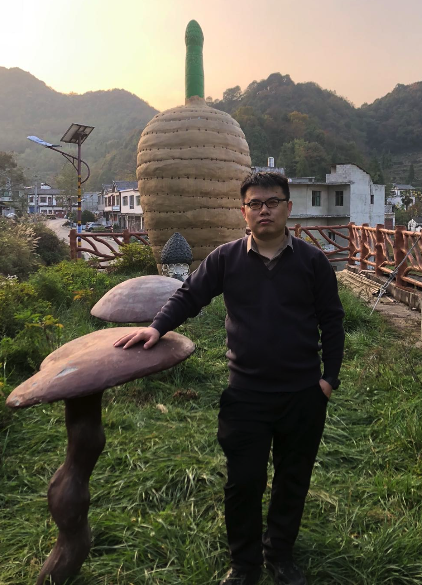
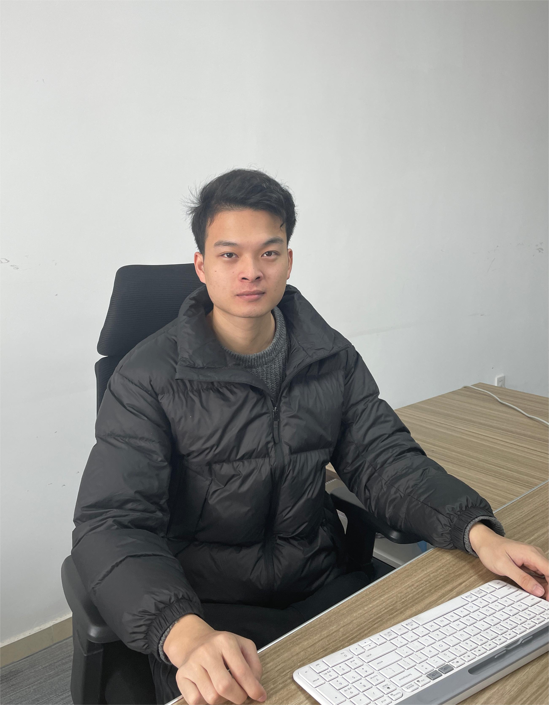
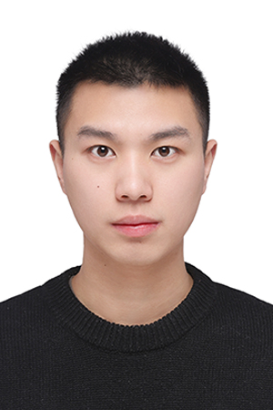
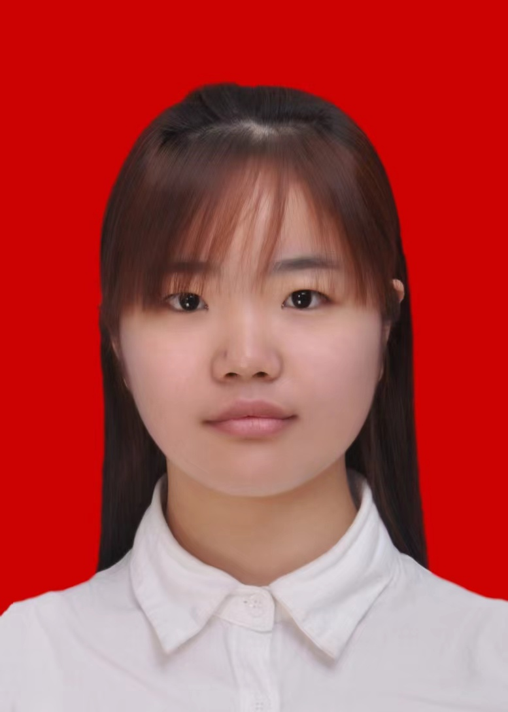
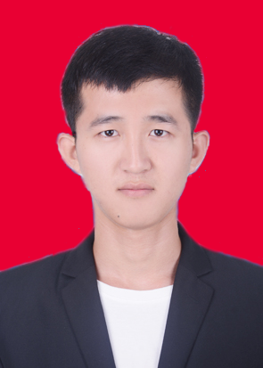
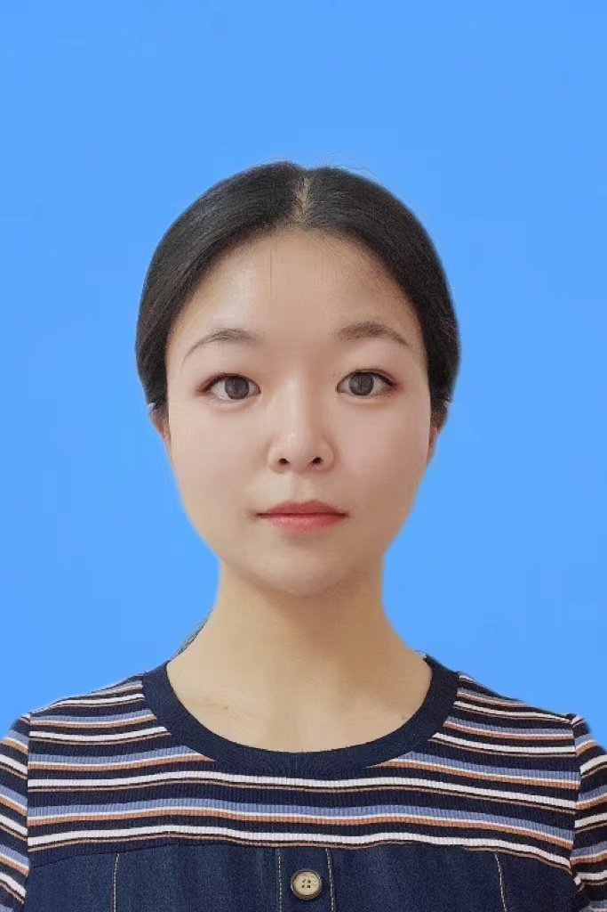
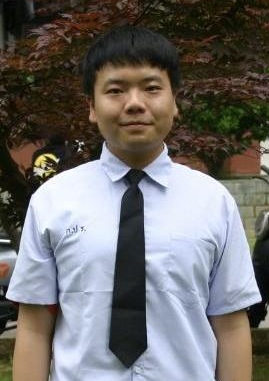

 

 

### Curriculum Vitae ([中文版本](Chinese.md))

 
Yiyong Zhao, male, born in 1991, PhD degree in bioinformatics from a successive master-doctor program at Fudan University and CSC-supported joint PhD program in Pennsylvania State University, USA （2019-2020)；Last year worked as a bioinformatics& AI research scientist at Drug Farm in Shanghai, an innovative drug discovery company leading by Dr. Tian Xu, a Chair Genetics Professor at Yale and Vice President at Westlake University. In this Pharmaceutical company, mainly worked on indications and biomarkers discovery and was involved in a graph neural network-based method to dig first-in-class drug targets. 

Currently, just starting a professor position at Guizhou University and have been selected as the [Special-term Professor Class A](htmls/GZU_Recruitment.html) of the College of Agriculture in [Guizhou University](http://www.gzu.edu.cn/en/) in 2022. The specialized direction in crop genetic breeding at Guizhou University.

 
I mainly engaged in gene mining for important agronomic traits with more than 10 SCI paper publications, including Nature, Molecular Plant and other top journals in the past five years. The published papers were selected as the major basic research results in Shanghai in 2021 and the major achievements of the Chinese Science and Technology Journal Excellence Program, providing an important foundation for crop germplasm resource conservation and breeding; and laying the foundation for genomics in molecular cultivation breeding.I have presided over or participated in the National Foundation, Guizhou University high-level talent start-up funding projects, etc. Reviewed multiple papers, Including papers publised in the journals of Molecular Plant, Horticulture Research, Frontiers Molecular Biosciences, Molecular Phylogenetics and Evolution, Journal of Systematics and Evolution, etc.

Mobile: +86 13262259838 
Email: fudan@yiyongzhao.com 
Address: Room 1035, Chonghou Building of West Campus, Guizhou University, Guiyang City, Guizhou Province, China, 550025
				
### Education

2016.06 ~ 2021.06：Ph.D.in Bioinformatics, School of Life Sciences, Fudan University, China 

2019.09 ~ 2020.10：China Scholarship Council (CSC) Joint Ph.D. Program, Department of Biology, Pennsylvania State University, USA

2012.06 ~ 2016.06：Bachelor of Science in Agriculture (*summa cum laude*), Northeast Forestry University, China

2013.06 ~ 2014.01：CSC Joint Bachelor Program, Kangwon National University, South Korea.

### Work Experience

2022.10 ~ present: Professor (Special-term Professor Class A), Guizhou University, China

2021.07 ~ 2022.08: Bioinformatics & AI Scientist, at [Drug Farm Co. Ltd](https://drug-farm.com), Shanghai
	
### Research Interests

Biological big data mining; genomics, phylogenomics and comparative genomics; bioinformatics software development; genome assembly, genome evolution such as whole genome duplications; hybridization detection; gene evolution and functional genomics.

### Publications (# Co-first author, * Corresponding author)

1. __ZHAO Y__, ZHANG R, JIANG K, QI J, HU Y, GUO J, ZHU R, ZHANG T, EGANA N, YI T-S, HUANG C-H, MA H 2021. Nuclear phylotranscriptomics/phylogenomics support numerous polyploidization events and hypotheses for the evolution of rhizobial nitrogen-fixing symbiosis in Fabaceae. **Molecular Plant** [J]. 2021, 14(5): 748-773 (First author, **IF= 13.164**, Cover story & Featured article, the study reported in dozens of domestic and international mainstream media such as Guangming Daily, People's Daily, China News, Science Daily, Phy.org, etc., Contribution: for the cover article, based on the transcriptome and genome, we constructed the largest phylogenetic relationship of Leguminosae to date. Phylogenetic relationships were resolved for five subfamilies, about 30 genome-wide replication events were identified, the evolutionary history of the nitrogen-fixing gene family was explored, and the important role of a new gene in nitrogen fixation was proposed, providing an important basis for germplasm conservation and breeding in the legume family.)

2. ZHANG L#\*, CHEN F#, ZHANG X#, LI Z#, **ZHAO Y#**, LOHAUS R#, CHANG X#, DONG W, HO S Y W, LIU X, SONG A, CHEN J, GUO W, WANG Z, ZHUANG Y, WANG H, CHEN X, HU J, LIU Y, QIN Y, WANG K, DONG S, LIU Y, ZHANG S, YU X, WU Q, WANG L, YAN X, JIAO Y, KONG H, ZHOU X, YU C, CHEN Y, LI F, WANG J, CHEN W, CHEN X, JIA Q, ZHANG C, JIANG Y, ZHANG W, LIU G, FU J, CHEN F, MA H, VAN DE PEER Y, TANG H 2020. The water lily genome and the early evolution of flowering plants. **Nature** [J], 577: 79-84. (Co-first author, **IF= 49.962**, ESI highly cited paper, Contribution: Involved in the assembly, annotation and correction of transcriptome data of the first aquatic early angiosperm genome. Based on 115 transcriptome and genome-wide data, a highly supported phylogenetic tree of flowering plants was constructed, and molecular clock analysis revealed that early angiosperms originated in the early Cretaceous, while highly supporting the phylogenetic relationships within the Water Lily family. Low-copy nuclear genes from the whole genome confirmed that saprophytic camphor was the earliest differentiated angiosperm. Meanwhile, using a comparative genomics approach, the Blue Star water lily was identified as a potential hybrid parent of two cultivars, laying the foundation for genomics in molecular cultivation breeding.)

3. Lin Cheng, Mengge Li, Yachao Wang, Qunwei Han , Yanlin Hao, Zhen Qiao, Wei Zhang, Lin Qiu, Andong Gong, Zhihan Zhang, Tao Li, Shanshan Luo, Linshuang Tang, Daliang Liu, Hao Yin, Song Lu, Tiago S.Balbuena and Yiyong Zhao*. Transcriptome-based Variations Effectively Untangling the Intraspecific Relationships and Selection Signals in Xinyang Maojian Tea Population. 2023 Volume 14, doi: 10.3389\/fpls.2023.1114284 **Frontiers in Plant Science in Plant Bioinformatics**. (**IF=6.627**)

4. CHENG L, CHEN F, HAN Q, LI M, Tiago Santana Balbuena, __ZHAO Y\*__. Phylogenomics as an effective approach to untangle cross-species hybridization event: a case study in the family Nymphaeaceae. 2022. 13. **Frontiers in Genetics-section in computational genomics**. (**IF=4.772**)

5. CHENG L#, LI M#, HAN Q, QIAO Z, HAO Y, Tiago Santana Balbuena, __ZHAO Y\*__. Phylogenomics Resolves the Phylogeny of Theaceae by Using Low-Copy and Multi-Copy Nuclear Gene Makers and Uncovers a Fast Radiation Event Contributing to Tea Plants Diversity.2022. 11(7): 1007. **Biology** (**IF=5.168**)

6. ZHANG L, ZHU X, **ZHAO Y**, Guo J, ZHANG T, HUANG W, HUANG J, HU Y, HUANG C*, MA H 2022. Phylotranscriptomics Resolves the Phylogeny of Pooideae and Uncovers Factors for Their Adaptive Evolution. **Molecular Biology Evolution** [J], 39(2): msac026. (**IF= 16.24**)

7. GUO J, XU W, HU Y, HUANG J, **ZHAO Y**, ZHANG L, HUANG C-H, MA H 2020. Phylotranscriptomics in Cucurbitaceae reveal multiple whole genome duplications and key morphological and molecular innovations. **Molecular Plant** [J], 13: 1-17. (**IF=13.164**)

8. HE C, CHEN Z, **ZHAO Y**, YU Y, WANG H, WANG C, QI J, WANG Y 2022 Histone demethylase IBM1-mediated meiocyte gene expression ensures meiotic chromosome synapsis and recombination.2022. **Plos Genetics** [J], 18(2): e1010041.(**IF= 5.917**)

9. LIANG Y, WANG S, ZHAO C, MA X, **ZHAO Y**, SHAO J, LI Y, LI H, SONG H, MA H, LI H, ZHANG B, ZHANG L 2020. Transcriptional regulation of bark freezing tolerance in apple (*Malus domestica* Borkh.). **Horticulture Research** [J], 7: 205. (**IF= 6.072**)

10. MENG Z, HAN J, LIN Y, **ZHAO Y**, LIN Q, MA X, WANG J, ZHANG M, ZHANG L, YANG Q, WANG K 2020. Characterization of a *Saccharum spontaneum* with a basic chromosome number of x = 10 provides new insights on genome evolution in genus *Saccharum*. **Theoretical and Applied Genetics** [J], 133: 187-199. (**IF= 5.699**)

11. HUANG W, ZHANG L, COLUMBUS J T, HU Y, **ZHAO Y**, TANG L, GUO Z, CHEN W, MCKAIN M, BARTLETT M, HUANG C-H, LI D-Z, GE S, KELLOGG E A, HONG M 2021. A Well-supported nuclear phylogeny of Poaceae and implications for the evolution of C4 photosynthesis. **Molecular Plant**[J], 15(4): 755-777. (**IF=13.164**)

12. MENG F, LIU L, PENG M, WANG Z, WANG C, **ZHAO Y** 2015. Genetic diversity and population structure analysis in wild strawberry (*Fragaria nubicola* L.) from Motuo in Tibet Plateau based on simple sequence repeats (SSRs). **Biochemical Systematics and Ecology** [J], 63: 113-118. (**IF=1.381**)

12. ZHENG Y, **ZHAO Y**, WU L, LIN J. Copy number variation and diversification of duplicates in *CaCA* gene family of *Capsella*. 2020. **Journal of Fudan University** (Natural Science) [J], 59, No.1:1-31. (In Chinese)

### Collaborators

Dr. [Lin Cheng](htmls/Lincheng.html), Associate Professor, Xinyang Normal University

Dr. [Mingjin Huang](https://www.scholarmate.com/P/EFv2Mv), Associate Professor, Guizhou University

### Students

 
Tao Li (MD candidate, Develop evolutionary developmental genomics algorithms and software, hobby photography cycling programming, good at ps image processing and pr video processing, outgoing lively and cheerful personality, but social fear.)

 
Hao Yin (MD candidate, Research Interests: Comparative Genomics of Poaceae, Hao is cheerful, optimistic and have a good teamwork spirit. My favorite sports are table tennis and badminton.)

 

 
Daliang Liu (Research Associate, MD from Nanjing Agricultural University; Research Direction: Population genomics and bioinformatics; Motto: The mountain is high, take each step well, you can conquer it)

 

 
Song Lu (Research Associate; Research Direction: Comparative Genomics; come from the mountain city of Chongqing, Enjoy the peace and quiet of Nature and the vastness and mystery of the universe.)

 

 
Linshuang Tang (MD candidate, Co-supervised with Dr. Huang, Research Interests: Comparative Genomics, Personal Quotes: People with self-confidence can turn smallness into greatness and mediocrity into magic; they can do a little more than nothing.)

 
Shanshan Luo(MD candidate, Co-supervised with Dr. Huang, Research direction: comparative genomics, passionate about photography guitar, dance, baking, travel, and will usually try a variety of homemade DIY)

 

 
Mengge Li (MD, Research Associate; Co-supervised with Dr. Cheng,  Research Direction: Phylogenomics and bioinformatics; enjoy growing succulents, listening to music, and playing badminton, etc.)

 

 
Yanlin Hao (MD candidate, Co-supervised with Dr. Cheng, Research Direction: Functional genomics and molecular evolution; During my leisure time, I enjoy singing with a small group of friends, traveling, and enjoying life's beauty.)

 

 
Qunwei Han (MD candidate, Co-supervised with Dr. Cheng, Research Direction: Evolutionary Genomics & Bioinformatics; Sports, volleyball, handicrafts, badminton, reading, and food are among my favorite things.)

 

 
Zhen Qiao (MD candidate, Co-supervised with Dr. Cheng, Research Direction: Evolutionary Genomics & Bioinformatics; A cheerful personality with a wide range of interests, including calligraphy, painting, seal carving, reading, etc.)

 
Zhipeng Li (Undergraduate student, Research direction: molecular evolution, love the bamboo flute and data analysis, good at organizing data and classification, optimistic and lively personality, especially like new things.)

 

 
Qiyu Chen (Undergraduate student, Research direction: molecular evolution, enjoys sports, like to see the outside world, good at playing ball, Premiere clipping.)

 

 
Yinjie Jiao (Undergraduate student, Research direction: molecular evolution, I enjoy playing ping pong, I'm an introvert, more of a quiet person.)
